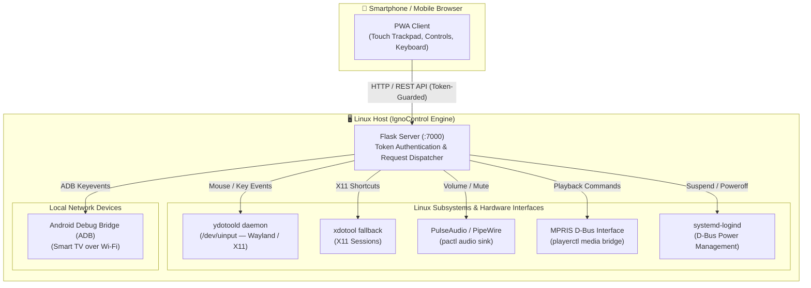

# 🚀 IgnoControl

> **A modern, lightweight web-based remote control, virtual trackpad, and keyboard for Linux PCs and Smart TVs.**

[](https://python.org)
[](https://flask.palletsprojects.com/)
[-FCC624?style=flat-square&logo=linux&logoColor=black)](https://kernel.org)
[](LICENSE)
[](https://github.com/edufeq03/tvcontrol/pulls)

🌐 **Languages:** **English** | [🇧🇷 Versão em Português](README.pt-BR.md)

---

## 💡 Overview

**IgnoControl** transforms any smartphone on your local Wi-Fi network into an intuitive multimedia remote, low-latency virtual trackpad, and wireless keyboard for your Linux computer and Android TV.

Built as an installable **Progressive Web App (PWA)**, it requires zero mobile client installations—just scan the generated QR code or open the local URL, and control your workstation from the couch.

---

## ✨ Features

* 🖱️ **Low-Latency Virtual Trackpad:** Real-time touch cursor navigation, multi-button clicks (left, right, middle), and natural scroll gestures. Fully compatible with modern **Wayland** compositors (GNOME, KDE Plasma, Sway) and **X11** via `ydotool` and `xdotool`.
* ⌨️ **Wireless Keyboard & Hotkeys:** Send raw text input, window shortcuts, and navigation keys (Escape, Enter, BackSpace, Arrow keys) directly to the active session.
* ⏯️ **Unified Media Control:** Instant Play/Pause, track seeking (10s back/forward), and Netflix/YouTube shortcuts via Linux MPRIS specification (`playerctl`).
* 🔊 **Precise Volume Engine:** Granular volume adjustment and mute toggling integrated directly with PulseAudio and PipeWire (`pactl`).
* 📺 **Android TV Bridge:** Seamlessly dispatch keyevents to Android TVs on the local network using ADB over Wi-Fi (`adb shell input keyevent`).
* 🌙 **Power & Display Management:** Remote display blanking (`dpms off`), KDE/GNOME window fullscreen toggle, and safe shutdown / suspend with confirmation prompts.
* ⏱️ **Configurable Sleep Timer:** Set an automated shutdown timer directly from your phone.
* 📲 **Installable PWA:** Can be saved to the mobile home screen for a fullscreen native-app look and feel with haptic feedback.
* ⚡ **Zero-Friction QR Pairing:** Terminal and web-rendered QR codes for instant mobile device connection.

---

## 🏗️ System Architecture

IgnoControl bridges standard web standards (PWA, REST API) with low-level Linux subsystems and user-space daemons:



---

## 🧠 Engineering Highlights & Design Decisions

### 1. Overcoming the Wayland Input Security Isolation
In traditional X11 environments, utilities like `xdotool` simulate mouse and keyboard events easily. However, modern Wayland compositors (GNOME, KDE Plasma 6, Sway) intentionally isolate client windows from intercepting or injecting global input for security reasons.
* **Solution:** IgnoControl configures and connects to a background `ydotoold` daemon through a dedicated UNIX socket (`/tmp/.ydotool_socket`) interfacing with Linux's kernel `/dev/uinput` subsystem. This ensures universal, compositor-agnostic input simulation without requiring root privileges for the Flask process.

### 2. Privilege Separation & Security Model
* **Non-Root Execution:** The server runs exclusively within the unprivileged user session using `systemctl --user`.
* **Token Authentication:** Requests are guarded by a session token passed via URL parameter, HTTP header, or cookie, preventing unauthorized access from other devices on the local network.
* **Safe Power Management:** System power operations (suspend, shutdown) leverage `systemd-logind` policies rather than elevated `sudo` commands.

### 3. Automated Cross-Distro Deployment
The provided universal installer (`install.sh`) automatically detects package managers (`apt`, `dnf`, `pacman`, `zypper`), sets up an isolated Python virtual environment, registers the `ydotool` systemd service, opens local firewall ports (`ufw`, `firewalld`), and configures system autostart.

---

## ⚡ Quick Start

### Installation

Clone the repository and run the automated installer:

```bash
git clone https://github.com/edufeq03/tvcontrol.git
cd tvcontrol
./install.sh
```

### Managing the Service

IgnoControl runs as a user-level Systemd daemon and starts automatically upon login:

```bash
# Check service status
systemctl --user status ignocontrol

# Restart service (e.g., after editing config.json)
systemctl --user restart ignocontrol

# Stop service
systemctl --user stop ignocontrol
```

To run in the foreground with an interactive terminal QR Code:
```bash
./venv/bin/python remote.py
```

### Connecting from Mobile

1. Ensure your smartphone is connected to the same Wi-Fi network as your PC.
2. Scan the **QR Code** printed in the terminal or navigate to:
   ```text
   http://<YOUR_PC_IP>:7000/?token=minhachave123
   ```
3. *(Optional)* Tap **"Add to Home Screen"** in your mobile browser to install it as a standalone PWA.

---

## ⚙️ Configuration (`config.json`)

All buttons, labels, and shell commands are fully customizable via `config.json` or the web interface:

```json
{
  "id": "play",
  "label": "Play / Pause",
  "sub": "Toggle playback",
  "comando": "playerctl play-pause 2>/dev/null || xdotool key space",
  "icone": "play",
  "cor": "blue",
  "largura": "cheia",
  "tag": "Media",
  "confirmar": false,
  "ativo": true
}
```

### Adding Android TV Commands:
If your Android TV has ADB debugging enabled over Wi-Fi:
```json
{
  "id": "tv-vol-up",
  "label": "TV Vol +",
  "sub": "Android TV",
  "comando": "adb -s 192.168.1.100 shell input keyevent 24",
  "icone": "vol-up",
  "cor": "cyan",
  "largura": "metade",
  "tag": "TV",
  "confirmar": false,
  "ativo": true
}
```

---

## 📡 REST API Reference

All endpoints expect token authentication via `?token=<TOKEN>`, `X-Token: <TOKEN>`, or an active session cookie:

| Method | Endpoint | Parameters | Description |
|---|---|---|---|
| `POST` | `/mouse/move` | `{"dx": int, "dy": int}` | Relative cursor movement |
| `POST` | `/mouse/click` | `{"btn": "left"\|"right"\|"middle"}` | Trigger mouse click |
| `POST` | `/mouse/scroll` | `{"dy": int}` | Vertical scrolling delta |
| `POST` | `/type` | `{"text": string}` | Simulates keystrokes for text |
| `POST` | `/key` | `{"key": string}` | Simulates special key (Enter, Escape, etc.) |
| `GET/POST` | `/volume` | `{"change": int}` or `{"value": int}` | Get or adjust master audio volume |
| `POST` | `/exec/<btn_id>` | None | Executes configured command action |
| `POST` | `/timer/set` | `{"minutes": int}` | Sets automatic shutdown timer |
| `POST` | `/timer/cancel` | None | Cancels active shutdown timer |
| `GET` | `/timer/status` | None | Returns remaining timer duration |

---

## 🧪 Testing & CI Automation

IgnoControl includes an automated test suite with over 70% coverage and GitHub Actions CI:

```bash
# Run automated test suite with coverage
./venv/bin/pytest --cov=tvcontrol --cov-report=term-missing tests/

# Run security static analysis (Bandit)
./venv/bin/bandit -lll -r tvcontrol remote.py
```

---

## 🔒 Security Policy

For security vulnerability reporting, threat modeling, and defense-in-depth details, see [SECURITY.md](SECURITY.md).

---

## 📜 Changelog

All release notes and sprint implementations are documented in [CHANGELOG.md](CHANGELOG.md).

---

## 🗑️ Uninstallation

To remove all created shortcuts, services, and system configurations cleanly:

```bash
./install.sh --uninstall
```

---

## 🤝 Contributing

Contributions, issues, and feature requests are welcome! Feel free to check the [issues page](https://github.com/edufeq03/tvcontrol/issues).

---

## 📄 License

This project is licensed under the **MIT License** - see the [LICENSE](LICENSE) file for details.
