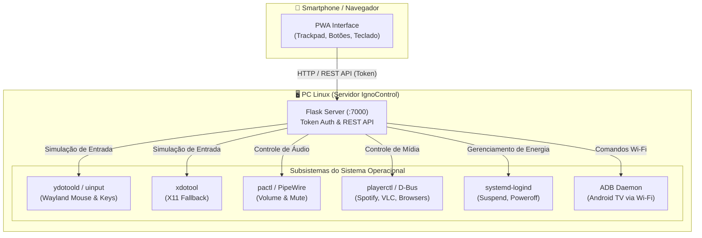

# 🚀 IgnoControl

> **Controle remoto web moderno e elegante para transformar seu smartphone em um controle multimídia e trackpad para o seu PC Linux e Smart TV.**

[](https://python.org)
[](https://flask.palletsprojects.com/)
[-FCC624?style=flat&logo=linux&logoColor=black)](https://kernel.org)
[](LICENSE)

🌐 **Idiomas:** [🇺🇸 English](README.md) | **🇧🇷 Português**

---

## 📱 O que o IgnoControl faz?

O **IgnoControl** cria uma interface web com suporte a **PWA (Progressive Web App)** acessível por qualquer smartphone conectado na mesma rede Wi-Fi que o seu computador. Com ele você tem controle total sem precisar de teclado ou mouse físico:

* 🖱️ **Trackpad e Mouse Virtual:** Mova o cursor, clique (esquerdo, direito, scroll) e role páginas com baixa latência na tela do smartphone (compatível com **Wayland** e **X11** via `ydotool` / `xdotool`).
* ⌨️ **Teclado Remoto:** Digite textos ou envie atalhos especiais (Enter, Esc, BackSpace, Setas) diretamente para o computador.
* ⏯️ **Controle Multimídia:** Play/Pause, avançar/retroceder vídeos (YouTube, Netflix, Spotify, VLC) via especificação MPRIS (`playerctl`) e atalhos de janela.
* 🔊 **Gerenciamento de Áudio:** Ajuste de volume (+/- 5%) e mute instantâneo integrados ao PulseAudio / PipeWire.
* 📺 **Integração com Android TV:** Controle aparelhos de TV na rede local via comandos ADB (`adb shell input keyevent`).
* 🖥️ **Controle de Energia e Monitores:** Descanso de tela (`dpms off`), tela cheia (`kwin` / `xdotool`) e desligamento seguro com confirmação.
* ⏱️ **Sleep Timer (Temporizador):** Programe o PC para desligar automaticamente após o tempo desejado.
* 📲 **PWA Instalável:** Pode ser adicionado à tela de início do smartphone como um aplicativo nativo em tela cheia.
* ⚡ **Pareamento Rápido via QR Code:** Exibido tanto no terminal na inicialização quanto na interface web.

---

## 🏗️ Arquitetura do Sistema



---

## ⚡ Instalação Rápida (1 Comando)

Clone o repositório e execute o instalador universal:

```bash
git clone https://github.com/edufeq03/tvcontrol.git
cd tvcontrol
./install.sh
```

### O que o `install.sh` faz automaticamente:
1. **Detecta o gerenciador de pacotes:** Suporte automático para `apt-get` (Debian, Ubuntu, Mint, Pop!_OS), `dnf` (Fedora), `pacman` (Arch, Manjaro) e `zypper` (openSUSE).
2. **Instala dependências do sistema:** `playerctl`, `ydotool`, `xdotool`, `pulseaudio-utils` e `libnotify-bin`.
3. **Isola o ambiente Python (`venv`):** Cria ambiente virtual isolado e instala `Flask` e gerador de `qrcode`.
4. **Configura o daemon do `ydotool` no Systemd:** Permite simulação de entrada em Wayland através de socket `/tmp/.ydotool_socket` e `/dev/uinput` sem requerer privilégios de root para a aplicação.
5. **Configura serviços e atalhos:**
   * Cria o serviço de usuário Systemd (`systemctl --user enable --now ignocontrol`).
   * Adiciona o atalho no Menu de Aplicativos (`~/.local/share/applications/`).
   * Configura o Autostart no login (`~/.config/autostart/`).
   * Adiciona atalho na Área de Trabalho (Desktop).
6. **Firewall:** Verifica e sugere/libera a porta 7000 no `ufw` ou `firewalld`.

---

## 🎮 Como Usar

### 1. Gerenciar o serviço do IgnoControl
O IgnoControl inicia automaticamente ao fazer login no sistema. Para gerenciar:

```bash
# Ver status do serviço
systemctl --user status ignocontrol

# Reiniciar o serviço (após alterar config.json)
systemctl --user restart ignocontrol

# Parar o serviço
systemctl --user stop ignocontrol
```

Ou execute manualmente em primeiro plano com QR Code no terminal:
```bash
./venv/bin/python remote.py
```

### 2. Conectar pelo Celular
* Aponte a câmera do smartphone para o **QR Code** exibido no terminal ou acesse diretamente:
  ```text
  http://<IP_DO_SEU_PC>:7000/?token=minhachave123
  ```
* Se o serviço rodar em segundo plano, uma **notificação de desktop** é emitida com o endereço de acesso.

---

## ⚙️ Personalização (`config.json`)

Você pode adicionar novos botões, alterar atalhos e comandos editando o arquivo `config.json` ou diretamente pela interface web:

```json
{
  "id": "play",
  "label": "Play / Pause",
  "sub": "Alternar reprodução",
  "comando": "playerctl play-pause 2>/dev/null || xdotool key space",
  "icone": "play",
  "cor": "blue",
  "largura": "cheia",
  "tag": "Mídia",
  "confirmar": false,
  "ativo": true
}
```

---

## 📡 Referência da API REST

Todas as requisições autenticam via query param `?token=...`, header `X-Token` ou cookie salvo na sessão:

| Método | Endpoint | Descrição |
|---|---|---|
| `POST` | `/mouse/move` | Move o cursor (`dx`, `dy`) |
| `POST` | `/mouse/click` | Executa clique (`btn`: `left`, `right`, `middle`) |
| `POST` | `/mouse/scroll` | Rola a tela verticalmente (`dy`) |
| `POST` | `/type` | Digita texto no sistema (`text`) |
| `POST` | `/key` | Envia tecla especial (`key`) |
| `GET/POST` | `/volume` | Consulta ou altera volume (`change`, `value`) |
| `POST` | `/exec/<btn_id>` | Executa comando pré-configurado do `config.json` |
| `POST` | `/timer/set` | Define temporizador de desligamento (`minutes`) |
| `POST` | `/timer/cancel` | Cancela o temporizador ativo |

---

## 🗑️ Desinstalação

Para remover atalhos, serviços e configurações automáticas:

```bash
./install.sh --uninstall
```

---

## 📄 Licença

Distribuído sob a licença **MIT**. Consulte o arquivo [LICENSE](LICENSE) para obter mais informações.
